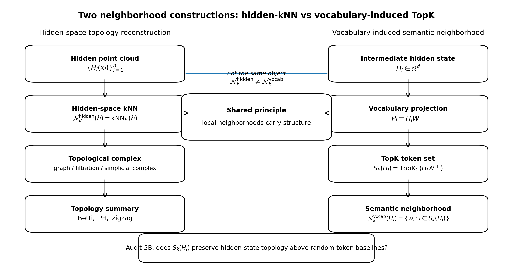
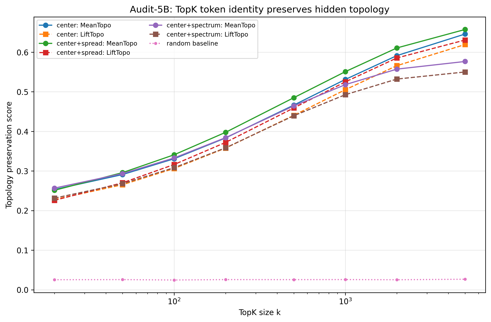
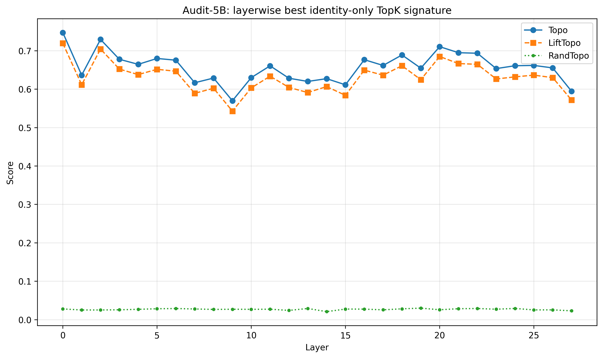
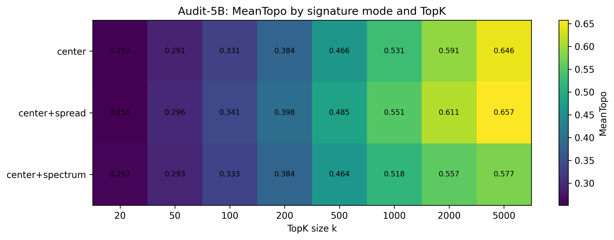

# From Hidden Topology to Vocabulary Neighborhoods  
## TopK Token Sets as Semantic Observables in LLMs

zhaoheng Beihang University

---

## Abstract

Full vocabulary logits are a linear readout of hidden states, and therefore it is not surprising that they retain some information about hidden-state geometry. This paper asks a stricter question: after removing logit magnitudes, probabilities, and rank scores, do the identities of the selected TopK vocabulary tokens still preserve hidden-state topology?

Given an intermediate hidden state \(H_l\) and the vocabulary projection matrix \(W\), we define the vocabulary-induced TopK neighborhood as

$$
\mathcal{N}_k(H_l)=\operatorname{TopK}_k(H_lW^\top).
$$

This object is not hidden-space kNN. Hidden-kNN reconstructs topology among hidden vectors, whereas vocabulary-induced TopK maps a hidden state into a discrete semantic neighborhood indexed by vocabulary tokens. The distinction is central: the latter object is closer to the model’s vocabulary-level generative interface, but it may also be a projection artifact of the language-model head.

This work evaluates the strongest simple version of the claim by keeping only token identities. From each TopK set, we construct three identity-only signatures: center, center+spread, and center+spectrum. We compare these signatures with the original hidden-state geometry using distance Spearman correlation, KNN overlap, CKA, and a composite topology-preservation score. The best result occurs at \(k=5000\) with center+spread, where the signature substantially exceeds random-token baselines.

The conclusion is deliberately conservative: vocabulary-induced TopK token neighborhoods preserve substantial hidden-state topology above random baselines. This does not prove causality, nor does it rule out all vocabulary-space artifacts. It does, however, establish \(\operatorname{TopK}_k(H_lW^\top)\) as a measurable semantic observable and creates the precondition for studying its layerwise dynamics.

---

## 1. Introduction

This work began from a simple dissatisfaction with the standard description of large language models as impenetrable black boxes. The fact that these systems are difficult to interpret does not necessarily mean that their internal computation is intrinsically inaccessible. A more plausible possibility is that we have been looking at objects that are too close to the implementation layer. While neurons, activation vectors, and parameters are readily measurable, they are not self-evidently the correct foundational objects for understanding the mathematical structure of inference.

Recent topological studies of hidden representations offer a useful alternative. Instead of treating a hidden state as only a vector in a high-dimensional Euclidean space, these studies ask whether collections of hidden states carry recoverable topology. This is an important change of coordinates. Topology is less tied to individual neuron axes, and therefore gives us a way to ask whether model computation has a structural shape that survives changes in representation. But this leaves a second problem unresolved. Hidden-state topology gives us a mathematical object, yet it does not by itself explain how that object is connected to the model’s vocabulary-level generative interface.

The motivating question of this paper is therefore not simply whether hidden states exhibit topology. It is whether there is an observable bridge between the continuous representation layer and the discrete vocabulary space. Such a bridge would need to sit closer to the model’s own readout mechanism than a raw hidden-state point cloud, while still retaining enough information about the hidden geometry to be useful.

The vocabulary projection matrix \(W\) suggests a natural candidate. During generation, a hidden state is not used in isolation; it is read through \(W\) into vocabulary space. This readout does not only matter at the final layer. At every intermediate layer, the projection \(H_lW^\top\) induces a ranked neighborhood of vocabulary tokens. The central hypothesis tested here is that this vocabulary-induced neighborhood is not merely an output-side artifact, but may preserve part of the local topology of the hidden representation that produced it.

This led to the object studied here:

$$
\mathcal{N}_k(H_l)=\operatorname{TopK}_k(H_lW^\top).
$$

The important point is that this is not the same as hidden-space kNN. Hidden-kNN constructs neighborhoods among hidden vectors and is used to reconstruct topology directly in hidden space. The object above is different: it is a vocabulary-induced semantic neighborhood selected by a hidden state through the model head. If the two objects were completely unrelated, then \(\operatorname{TopK}(H_lW^\top)\) would be mostly an output-side artifact. But if the vocabulary-induced TopK neighborhood preserves hidden topology, then it can serve as a bridge: a measurable observation window between hidden representation geometry and vocabulary-level semantic structure.

This paper tests that bridge in its strongest simple form. Rather than using full logits, probabilities, or rank scores, we keep only the identities of the selected TopK tokens. If token identity alone preserves substantial hidden-state topology, then the selected vocabulary neighborhood is not merely a byproduct of decoding. It becomes a legitimate internal observable.

---

## 2. Related Work

### 2.1 Hidden-State Topology and kNN Reconstruction

Recent work in topological data analysis has begun to examine the topology of neural and language-model hidden states. A common pipeline constructs neighborhood graphs or filtrations over hidden-state point clouds and then uses persistent homology or zigzag persistence to track topological structure across layers. This line of work motivates the use of local-neighborhood constructions as tools for recovering hidden-state topology.

The present work does not replicate hidden-space kNN. Instead, it asks whether a different object, the vocabulary-induced TopK token set, inherits enough hidden-topological information to serve as a semantic observable.

### 2.2 Vocabulary Embeddings as Semantic Geometry

This paper treats the vocabulary projection matrix \(W\) not merely as a readout table, but as a learned geometric substrate on which hidden states induce local neighborhoods. This assumption should be stated carefully. We do not require \(W\) to be a smooth manifold in the strongest mathematical sense. The weaker claim is that learned vocabulary embeddings and output embeddings possess non-random semantic geometry, so that subsets of \(W\) can carry meaningful neighborhood structure.

Recent work on vocabulary embeddings during language-model training supports this weaker view. Papadimitriou and Prince study the geometry of input and output vocabulary embeddings in open-source language models and show that vocabulary embeddings quickly organize around semantic, syntactic, and frequency-based structure during training. This is directly relevant here because the object studied in this paper is constructed from the model’s vocabulary projection space rather than from an external semantic lexicon.

At the same time, the manifold interpretation of token embeddings requires caution. Robinson, Dey, and Chiang argue that token embeddings can violate a simple manifold hypothesis and propose a fiber-bundle-style null model to test local token-neighborhood structure. Their result is important for the present paper because it warns against treating vocabulary space as a clean Euclidean semantic manifold. The more careful position adopted here is that \(W\) supplies a structured vocabulary geometry, but that geometry may contain anisotropy, singularities, noise dimensions, and token-specific local irregularities.

Thus, the central empirical question is not whether \(W\) is a perfect semantic manifold. It is whether the actual TopK subsets induced by \(H_lW^\top\) preserve hidden-state topology beyond what can be explained by generic embedding geometry, token frequency, tokenization, or output-space anisotropy.

### 2.3 Representation Similarity and Alignment

This work uses representation-similarity tools to compare the geometry of hidden states and TopK-derived signatures. Distance Spearman correlation measures pairwise distance-order preservation. KNN overlap measures local neighborhood preservation. CKA measures global representational alignment. These metrics do not replace persistent homology, but they provide a practical first audit of whether the TopK-derived representation preserves hidden-state geometry.

---

## 3. Object: Vocabulary-Induced TopK Neighborhoods

### 3.1 Hidden-kNN and Vocabulary-Induced TopK Are Different Objects

The key object in this paper is easy to confuse with hidden-space kNN, so the distinction must be made explicit.

A hidden-space kNN construction builds a neighborhood graph among hidden vectors. Given a hidden point cloud \(\{H_l(x_i)\}_{i=1}^n\), it asks which hidden states are near each other in representation space. This object is useful for topology reconstruction.

Vocabulary-induced TopK begins with a single hidden state. It projects that state through the vocabulary matrix \(W\) and selects the tokens with the highest logits. It therefore asks a different question: which vocabulary tokens does this hidden state most strongly activate through the model head?

The two objects share a locality principle, but they live in different spaces.

| Object | Construction | Space | Main use |
|---|---|---|---|
| hidden-kNN | \(\operatorname{kNN}_k(h)\) over hidden vectors | hidden representation space | topology reconstruction |
| vocabulary-induced TopK | \(\operatorname{TopK}_k(H_lW^\top)\) | vocabulary-indexed semantic space | semantic neighborhood observation |
| VIM summary | \(Z_k(H)=(C_k,r_k)\) | token embedding summary space | neighborhood dynamics |

The bridge tested in this paper is not

$$
\operatorname{TopK}_{\text{hidden}}=\operatorname{TopK}_{\text{vocab}}.
$$

The bridge is weaker and more useful:

$$
\operatorname{Topology}(H_l)
\rightarrow
\operatorname{Topology}(\mathcal{N}_k(H_l)).
$$

### 3.2 Definition

Let

$$
H_{l,t}\in \mathbb{R}^d
$$

denote the hidden state at layer \(l\) and token position \(t\), and let

$$
W\in \mathbb{R}^{|V|\times d}
$$

be the vocabulary projection matrix, where \(|V|\) is the vocabulary size. The intermediate vocabulary logit vector is

$$
P_{l,t}=H_{l,t}W^\top .
$$

The vocabulary-induced TopK token set is defined as

$$
S_k(H_{l,t})
=
\{i\in V:\; P_{l,t,i}\ \text{is among the top } k \text{ entries of } P_{l,t}\}.
$$

The corresponding vocabulary-induced TopK neighborhood is

$$
\mathcal{N}_k(H_{l,t})
=
\{w_i\in W:\; i\in S_k(H_{l,t})\}.
$$

Here \(S_k(H_{l,t})\) is the identity-level representation of the neighborhood: it contains only token indices. The neighborhood \(\mathcal{N}_k(H_{l,t})\) maps those indices back into the vocabulary geometry through their associated vectors \(w_i\).

### 3.3 Why Identity-Only TopK?

There is an obvious weak version of the hypothesis that should not be overvalued. The full logit vector \(H_lW^\top\) is a linear readout of the hidden state, so it is expected to retain some information about the hidden representation. A positive result at the full-logit level would therefore be difficult to interpret: it could reflect nothing more than the fact that a high-dimensional linear projection preserves part of the original geometry.

The harder question is whether the vocabulary set induced by the ordering of these logits also preserves structure. This question is motivated by a simple intuition. The logit assigned to a token may be viewed not only as a score for generation, but also as a local estimate of how strongly that token is connected to the current hidden state. If the hidden state encodes a local semantic or relational configuration, then the highest-scoring tokens may form a neighborhood of strongly connected vocabulary items. In that case, the important object may not be the exact logit value itself, but the set of tokens whose relation to the hidden state is strong enough to enter the local neighborhood.

This leads to the identity-only test. We remove logit magnitudes, probabilities, and rank scores, and keep only the identities of the top \(k\) selected tokens:

$$
S_k(H_l)=\operatorname{TopK}_k(H_lW^\top).
$$

The question is then deliberately narrow: does the token set \(S_k(H_l)\), by itself, preserve measurable information about the topology or geometry of the hidden states that produced it? If it does, then vocabulary-induced TopK is not merely a truncated output distribution. It is a candidate observation window into the hidden structure of the model.

---

## 4. Signatures, Metrics, and Experimental Setup

### 4.1 Identity-Only Signatures

We construct three identity-only signatures of the vocabulary-induced TopK neighborhood.

#### Center

The first signature is the neighborhood center:

$$
C_k(H_{l,t})
=
\frac{1}{k}
\sum_{i\in S_k(H_{l,t})}
w_i .
$$

This center asks a minimal question: if only the selected token identities are retained, does the centroid of their vocabulary vectors preserve information about the hidden state that selected them?

#### Center + Spread

The second signature augments the center with a dispersion term. Define

$$
r_k(H_{l,t})
=
\frac{1}{k}
\sum_{i\in S_k(H_{l,t})}
\left(1-\cos(w_i,C_k(H_{l,t}))\right).
$$

The center+spread signature is

$$
Z_k^{cs}(H_{l,t})
=
\left(C_k(H_{l,t}), r_k(H_{l,t})\right).
$$

The spread term is included because two TopK neighborhoods may have similar centers but different local semantic volume. A compact neighborhood and a diffuse neighborhood can point in roughly the same direction while encoding different degrees of local uncertainty or semantic breadth.

#### Center + Spectrum

The third signature adds a local spectral summary. Let

$$
X_k(H_{l,t})
=
\{w_i-C_k(H_{l,t}) : i\in S_k(H_{l,t})\}
$$

be the centered token-neighborhood point cloud. We compute a low-rank spectrum of its covariance and denote the normalized leading eigenvalue vector by

$$
\sigma_k(H_{l,t})
=
(\sigma_1,\ldots,\sigma_m).
$$

The center+spectrum signature is

$$
Z_k^{spec}(H_{l,t})
=
\left(C_k(H_{l,t}), \sigma_k(H_{l,t})\right).
$$

These three signatures form a small measurement family. They are deliberately derived from token identity rather than logit magnitude. The center tests whether the selected token set has a meaningful average location in \(W\). The spread tests whether local neighborhood volume matters. The spectrum tests whether internal shape of the token set adds further structure.

### 4.2 Topology-Preservation Metrics

For each layer \(l\), each TopK size \(k\), and each signature type, we compare the resulting TopK-derived representation with the original hidden-state representation.

#### Distance Spearman

Distance Spearman correlation compares pairwise distance orderings. If two hidden states are close in hidden space, their TopK-derived signatures should also be close. This gives a global test of distance-rank preservation.

#### KNN Overlap

KNN overlap compares local neighborhood structure. For each sample, we compute its nearest neighbors in hidden-state space and in TopK-signature space, then measure the overlap between the two neighbor sets.

#### CKA

Linear CKA measures global representational alignment between the hidden states and the TopK-derived signatures.

#### Composite Topology Score

Finally, we define a simple composite topology-preservation score:

$$
\operatorname{Topo}
=
\frac{1}{2}\rho_{\operatorname{Spearman}}
+
\frac{1}{2}\operatorname{KNNOverlap}_{10}.
$$

This score is not meant to replace persistent homology. It is a practical summary of two complementary properties: global distance-order preservation and local neighborhood preservation.

In this first audit, the goal is not to fully reconstruct the topology of the hidden-state manifold. The goal is more limited: to test whether the vocabulary-induced TopK neighborhood retains enough hidden-structural information to be treated as a meaningful semantic observable.

### 4.3 Random Baseline and LiftTopo

To test whether the observed topology preservation could be reproduced by arbitrary vocabulary subsets, we construct a random-token baseline. For each hidden state and each TopK size \(k\), we sample a random token set of the same cardinality:

$$
S_k^{\text{rand}}(H_{l,t})
=
\{j_1,\ldots,j_k\},
\qquad
j_m \sim \operatorname{Uniform}(V).
$$

Using the same signature function applied to the true TopK set, we construct the corresponding random signature:

$$
Z_k^{\text{rand}}(H_{l,t})
=
\phi(S_k^{\text{rand}}(H_{l,t})).
$$

where \(\phi(\cdot)\) denotes one of the three identity-only signature maps: center, center+spread, or center+spectrum.

We then compute the topology-preservation score for the random baseline in the same way as for the true TopK signature:

$$
\operatorname{RandTopo}
=
\operatorname{Topo}(H_l, Z_k^{\text{rand}}(H_l)).
$$

The lift over random is defined as

$$
\operatorname{LiftTopo}
=
\operatorname{Topo}(H_l,Z_k(H_l))
-
\operatorname{RandTopo}.
$$

Here \(\operatorname{Topo}(H_l,Z_k(H_l))\) measures how well the true vocabulary-induced TopK signature preserves the hidden-state geometry, while \(\operatorname{RandTopo}\) measures how much of the same score can be reproduced by a random vocabulary subset of identical size. Therefore, \(\operatorname{LiftTopo}\) estimates the excess topology-preservation signal attributable to the actual TopK token identity set rather than to the mere act of selecting \(k\) vocabulary vectors.

This baseline is important because large token sets may preserve some geometry simply by averaging over many vocabulary embeddings. A high \(\operatorname{LiftTopo}\) rules out the weakest artifact explanation: that arbitrary token subsets of the same size can reproduce the observed result.

However, this control is not sufficient to eliminate all possible confounds. In particular, it does not control for token frequency, tokenization structure, or anisotropy in the vocabulary embedding / output projection space. A stronger future audit should therefore include frequency-matched random sets, tokenization-aware controls, and randomized or shuffled-\(W\) baselines.

### 4.4 Experimental Environment and Model Backbone

All experiments were conducted on a local open-weight language model. The model backbone used in this experiment is

$$
\text{Qwen2.5-1.5B-Instruct}.
$$

The model was loaded from a local checkpoint and evaluated in inference mode. Hidden states were extracted from every Transformer block using forward hooks. For each input text, we recorded the hidden state at the final token position of each layer:

$$
H_l = H_{l,t_{\text{last}}}.
$$

The vocabulary projection matrix was taken directly from the model’s language-model head:

$$
W = W_{\text{lm\_head}}.
$$

For each layer \(l\), we computed the intermediate vocabulary readout

$$
P_l = H_lW^\top,
$$

and then constructed the vocabulary-induced TopK token set

$$
S_k(H_l)
=
\operatorname{TopK}_k(P_l).
$$

The TopK sizes tested in this experiment were

$$
k\in\{20,50,100,200,500,1000,2000,5000\}.
$$

For each \(k\), we evaluated three identity-only neighborhood signatures:

$$
\text{center},\qquad
\text{center+spread},\qquad
\text{center+spectrum}.
$$

The experiment used the model’s output vocabulary embeddings as the geometric substrate for the TopK neighborhood. Before geometric comparison, vocabulary vectors were normalized when computing cosine-based distances and similarities. Hidden states were mean-centered layerwise before comparison.

The random baseline was repeated multiple times for each layer and TopK size. In the implementation used for this experiment, the number of random repetitions was

$$
N_{\text{random}}=5.
$$

The maximum input length was set to

$$
\text{MAX\_LEN}=160.
$$

The implementation used PyTorch and HuggingFace Transformers. The model was evaluated on GPU with half-precision weights where available:

$$
\text{dtype}=\text{float16}.
$$

A fixed random seed was used for reproducibility:

$$
\text{seed}=42.
$$

The purpose of this setup was not to benchmark model capability, but to audit whether the vocabulary-induced TopK neighborhood

$$
\operatorname{TopK}_k(H_lW^\top)
$$

retains hidden-state topology under an identity-only constraint. Therefore, all reported results should be interpreted as object-level evidence for the observability of TopK neighborhoods, not as a claim about Qwen-specific model performance.

---

## 5. Results

### 5.1 TopK Scaling: Broad Vocabulary Neighborhoods Preserve More Hidden Topology

**Figure 2.** MeanTopo and LiftTopo rise with \(k\). This is not a small detail. It changes what the object means.

At \(k=5000\), the summary is:

| Mode            | TopK | MeanSp | MeanKNN | MeanCKA | MeanTopo | RandTopo | LiftTopo |
| :-------------- | ---: | -----: | ------: | ------: | -------: | -------: | -------: |
| center          | 5000 | 0.6513 |  0.6405 |  0.8722 |   0.6459 |   0.0266 |   0.6194 |
| center+spread   | 5000 | 0.6595 |  0.6554 |  0.7875 |   0.6574 |   0.0266 |   0.6308 |
| center+spectrum | 5000 | 0.5635 |  0.5897 |  0.5820 |   0.5766 |   0.0265 |   0.5501 |

The strongest average signature is center+spread. At \(k=5000\), it reaches \(\operatorname{MeanTopo}=0.6574\) and \(\operatorname{LiftTopo}=0.6308\), while the random baseline remains near \(0.0266\).

The first result is that the vocabulary-induced TopK signatures are not close to the random-token baseline. Across all three identity-only signatures, the true TopK sets achieve substantially higher topology-preservation scores than random token sets of the same cardinality. This rules out the weakest artifact explanation: the effect is not reproduced merely by selecting \(k\) arbitrary vocabulary vectors.

The second result is more informative. The topology-preservation score increases as \(k\) grows. This trend changes how the TopK object should be interpreted. If the signal were concentrated only in a few output candidates, we would expect small \(k\) to be sufficient. Instead, the strongest preservation appears at the largest tested neighborhood size, especially at \(k=5000\).

This suggests that \(\operatorname{TopK}_k(H_lW^\top)\) should not be understood primarily as a short next-token candidate list. In the regime where topology preservation is strongest, it behaves more like a broad vocabulary-induced semantic neighborhood: a finite subset of many related tokens that jointly preserves information about the hidden-state geometry.

In other words, the experiment supports the following interpretation:

$$
\operatorname{TopK}_k(H_lW^\top)
\neq
\text{a small output-candidate list only}.
$$

Rather, for sufficiently large \(k\),

$$
\operatorname{TopK}_k(H_lW^\top)
\approx
\text{a broad semantic neighborhood induced by } H_l.
$$

This point is important for the rest of the paper. The object being studied is not merely the model’s most likely next tokens, but a wider vocabulary region selected by the hidden state through the projection matrix \(W\).

### 5.2 Layerwise Persistence: TopK Neighborhoods Are Not Only Final-Layer Artifacts

**Figure 3.** The best identity-only signature remains strong across layers. The strongest per-layer setting is almost always \(k=5000\) with center+spread.

Figure 3 gives a second important result. The topology-preservation signal is not confined to the final layer. Instead, a stable signal is observable across the entire network depth.

Across all measured layers, the best identity-only signature remains well above the random baseline. The strongest layerwise result occurs at

$$
L0,\quad k=5000,\quad \text{mode}=\text{center+spread},
$$

with

$$
\operatorname{Topo}=0.7471,\quad
\rho_{\operatorname{Spearman}}=0.7753,\quad
\operatorname{KNNOverlap}_{10}=0.7189,\quad
\operatorname{CKA}=0.8899,\quad
\operatorname{LiftTopo}=0.7193.
$$

More importantly, this is not an isolated peak. The layerwise best profile shows that the same broad-neighborhood signature remains strong throughout the network. For example, in the decision-side region the signal is still substantial:

$$
L20:\quad \operatorname{Topo}=0.7105,\quad \operatorname{LiftTopo}=0.6849,
$$

$$
L21:\quad \operatorname{Topo}=0.6948,\quad \operatorname{LiftTopo}=0.6665,
$$

$$
L22:\quad \operatorname{Topo}=0.6934,\quad \operatorname{LiftTopo}=0.6646.
$$

Even near the final layer, the signal does not collapse into the random baseline:

$$
L27:\quad \operatorname{Topo}=0.5945,\quad \operatorname{LiftTopo}=0.5717.
$$

This layerwise persistence changes the interpretation of the object. If the topology-preservation signal appeared only at the final layer, a simple explanation would be available: the model might merely be arranging the vocabulary distribution for next-token generation. In that case, \(\operatorname{TopK}_k(H_lW^\top)\) would be closer to a final decoding artifact than an internal observable.

The data do not support that narrow interpretation. Since topology-preservation signals are visible across the full network depth, the vocabulary-induced TopK neighborhood appears to track structure already present in intermediate hidden states. This does not prove that TopK neighborhoods causally drive inference, but it does establish them as quantifiable internal observables rather than merely final-layer output lists.

Thus, Figure 3 supports the following conservative conclusion:

$$
\boxed{
\operatorname{TopK}_k(H_lW^\top)
\text{ retains hidden-structural information across layers, not only at the output boundary.}
}
$$

### 5.3 Signature Ablation: Center, Spread, and Spectrum

**Figure 4.** Center+spread is strongest overall. Center+spectrum does not consistently improve on it.

Figure 4 compares the three identity-only signatures used to summarize the vocabulary-induced TopK neighborhood: center, center+spread, and center+spectrum.

The first observation is that the neighborhood center alone already captures a large fraction of the topology-preservation signal. This suggests that the selected token identities are not an arbitrary collection of labels. Once mapped back into the vocabulary geometry, their centroid \(C_k(H_l)\) already retains substantial information about the hidden state that selected them.

Adding the spread term improves the result. This is important because it shows that a broad semantic neighborhood cannot be fully described by a single point. Two TopK neighborhoods may have similar centers but different internal semantic volumes. The dispersion term \(r_k(H_l)\) captures part of this difference, and the improvement of center+spread over center alone suggests that neighborhood volume is a meaningful component of the TopK geometry.

However, adding the covariance-spectrum signature does not further improve performance. This is a useful negative result. It shows that feature stacking does not automatically produce better topology preservation. A richer descriptor can add noise or unstable variation rather than useful structure.

A reasonable interpretation is that the topology-preservation signal is mainly carried by two low-order properties of the vocabulary-induced neighborhood:

$$
C_k(H_l)
$$

and

$$
r_k(H_l).
$$

That is, the relevant information lies in where the neighborhood is located in \(W\), and how broadly it spreads around that location. By contrast, the higher-order covariance spectrum of the selected token set does not provide a clear additional gain in this audit.

This suggests a cautious conclusion. For preserving hidden-state topology, the internal high-order association structure of the token set, such as logical or relational organization among selected tokens, is not yet shown to be necessary. The current evidence instead points to a lower-order geometric summary:

$$
\boxed{
\text{TopK topology preservation}
\approx
\text{neighborhood center}
+
\text{semantic volume}.
}
$$

This does not mean that higher-order structure is absent. It only means that, under the present experiment measurements, center and spread explain most of the measurable topology-preservation signal, while the covariance-spectrum augmentation does not add a robust benefit.

---

## 6. What the Experiment Rules Out

This experiment does not prove everything we would like to know about vocabulary-induced TopK neighborhoods. It does not prove causality, and it does not yet rule out all possible artifacts. However, it does rule out three weak but important alternative explanations.

### 6.1 The Topology-Preservation Signal Is Not Simply Carried by Logit Magnitudes

A first possible explanation is that the observed topology-preservation signal comes from the full logit vector itself. This would be a weak result. Since

$$
P_l = H_lW^\top
$$

is a linear readout of the hidden state, it is expected to retain part of the geometry of \(H_l\). If the experiment only showed that full logits preserve hidden-state structure, the result would be difficult to interpret. It could simply reflect the fact that a high-dimensional linear projection still contains substantial information about its input.

This experiment removes this explanation by discarding logit magnitudes before constructing the tested signatures. The experiment does not use the values of \(P_{l,i}\). Instead, it keeps only the identities of the selected tokens:

$$
S_k(H_l)=\operatorname{TopK}_k(H_lW^\top).
$$

The center, center+spread, and center+spectrum signatures are all derived from this token identity set. Therefore, the measured topology-preservation signal cannot be attributed directly to the numerical size of the logits.

The result should be read carefully. It does not mean that logits are irrelevant to the model. Logits determine which tokens enter the TopK set. But once the set is selected, the topology-preservation measurement no longer uses the logit values themselves. The signal survives after the magnitude information has been removed.

### 6.2 The Signal Is Not Simply Carried by Probabilities or Rank Scores

A second possible explanation is that the topology signal comes from probabilities or fine-grained rank information. For example, one might suspect that the probability gap between the top tokens, or the detailed order of tokens inside the TopK set, is what preserves the hidden-state geometry.

This experiment also removes this explanation. The identity-only test does not use probability values, softmax weights, rank scores, logit gaps, or within-TopK ordering weights.

The tested object is not a weighted distribution over the selected tokens. It is the selected token set itself. In the strongest form, the experiment asks whether the set

$$
\{i_1,\ldots,i_k\}
$$

contains structural information after all score-like quantities have been discarded.

This is why the result is stronger than a standard logit or probability-space analysis. If the topology-preservation signal depended mainly on probability mass or rank gaps, then removing those quantities should have destroyed most of the effect. Instead, the identity-only signatures still preserve substantial hidden-state topology. This suggests that the membership of the TopK neighborhood carries structure, not merely the probability values assigned to its members.

Again, this does not imply that ranking is meaningless. The ranking process is how the set is produced. But the experiment shows that after the set has been selected, the identities of the included tokens are already informative.

### 6.3 The Signal Is Not Reproduced by Random Token Selection

A third possible explanation is that any sufficiently large subset of vocabulary embeddings would preserve some hidden-state geometry. This concern is especially important because the strongest results appear at large \(k\), particularly \(k=5000\). Large token sets could, in principle, produce stable geometric summaries simply by averaging over many vocabulary vectors.

To test this, the experiment constructs random-token baselines. For each hidden state and each TopK size \(k\), a random token set of the same cardinality is sampled:

$$
S_k^{\text{rand}}(H_l)
=
\{j_1,\ldots,j_k\},
\qquad
j_m\sim \operatorname{Uniform}(V).
$$

The same signature construction is then applied to the random set:

$$
Z_k^{\text{rand}}(H_l)
=
\phi(S_k^{\text{rand}}(H_l)),
$$

where \(\phi\) denotes the center, center+spread, or center+spectrum signature map.

The random baseline topology score is

$$
\operatorname{RandTopo}
=
\operatorname{Topo}(H_l,Z_k^{\text{rand}}(H_l)).
$$

The excess signal above random is measured by

$$
\operatorname{LiftTopo}
=
\operatorname{Topo}(H_l,Z_k(H_l))
-
\operatorname{RandTopo}.
$$

The empirical result is that true vocabulary-induced TopK signatures remain far above the random baseline. This rules out the weakest random-selection explanation: the observed topology preservation is not reproduced by arbitrary vocabulary subsets of the same size.

However, this control has a clear boundary. Random token sets do not control for token frequency, tokenization structure, or anisotropy in the vocabulary embedding space. Therefore, this experiment rules out arbitrary random selection, but it does not yet rule out all vocabulary-space artifacts. Stronger future controls should include frequency-matched random sets, tokenization-aware baselines, rank-shuffled TopK sets, and randomized or permuted-\(W\) baselines.

---

## 7. Remaining Confounds

Although this experiment rules out several weak explanations, three important confounds remain unresolved. These confounds are not minor technical details. They directly determine how strong the final interpretation of vocabulary-induced TopK neighborhoods can be.

### 7.1 Token Frequency

A first unresolved confound is token frequency. High-frequency tokens may occupy stable or dense regions of the vocabulary embedding space. If many TopK sets include such tokens, then part of the observed topology-preservation signal may come from frequency-driven geometry rather than from the semantic neighborhood induced by the hidden state.

The random-token baseline does not fully remove this possibility. Randomly sampled token sets are unlikely to match the frequency distribution of the true TopK sets. As a result, a true TopK set and a random set may differ not only in semantic structure, but also in how many frequent or globally central tokens they contain.

A stronger control should therefore use frequency-matched random token sets. For each true TopK set

$$
S_k(H_l),
$$

one should construct a baseline set

$$
S_k^{\text{freq}}(H_l)
$$

with a similar token-frequency profile. If the topology-preservation signal remains high after this control, then the result would be less likely to be explained by frequency alone.

### 7.2 Tokenization Effects

A second unresolved confound is tokenization. Different prompts can induce token sets with systematic tokenization patterns. For example, some semantic domains may produce more subword fragments, punctuation-like tokens, capitalization variants, or morphology-related pieces. These tokenization regularities may create geometric structure in the vocabulary embedding space even when the semantic neighborhood itself is not the true cause.

This matters because vocabulary-induced TopK neighborhoods are constructed over token ids, not over ideal semantic units. A token set may therefore preserve some hidden-state structure because it reflects tokenization patterns associated with the input distribution.

The current experiment does not fully separate semantic-neighborhood structure from tokenization structure. Future controls should compare TopK sets under tokenization-aware baselines, such as matching the distribution of subword length, token type, capitalization, or morphological form. Another useful control would be to group tokens into higher-level lexical units and test whether topology preservation survives after reducing tokenization artifacts.

### 7.3 Output-Embedding Anisotropy

A third unresolved confound is anisotropy in the vocabulary embedding or output projection space. The vectors in \(W\) may already contain global geometric structure unrelated to the local semantic neighborhood induced by a given hidden state. For example, if the output embedding space has dominant directions, dense hubs, or globally uneven distance distributions, then some TopK-derived signatures may align with hidden-state geometry for reasons unrelated to meaningful semantic neighborhood selection.

This is especially relevant for center-based signatures. The center

$$
C_k(H_l)
=
\frac{1}{k}
\sum_{i\in S_k(H_l)}
w_i
$$

may partly reflect global biases in the geometry of \(W\), rather than only the structure of the selected semantic neighborhood.

A stronger audit should therefore include randomized or permuted-\(W\) controls. One possible test is to preserve the hidden states and TopK selection procedure, but replace \(W\) with a shuffled, randomly rotated, or otherwise geometry-disrupted version:

$$
W \rightarrow W^{\text{perm}}.
$$

If the topology-preservation score remains high under such a control, then output-space anisotropy would be a serious concern. If the score collapses, it would support the interpretation that the original vocabulary geometry and the actual TopK selection structure are carrying meaningful information.

These three confounds define the next stage of the audit. Frequency matching, tokenization-aware controls, and randomized-\(W\) baselines are necessary before the result can be treated as a fully controlled claim about semantic topology preservation.

---

## 8. Scholarly Value of This Object

Even with the unresolved confounds above, the present result changes the object of study. If \(\operatorname{TopK}(H_lW^\top)\) were only meaningless output-side noise, then studying its layerwise evolution would have little value. In that case, the sequence

$$
\mathcal{N}_k(H_l)
\rightarrow
\mathcal{N}_k(H_{l+1})
$$

would merely describe fluctuations in a readout artifact.

The experiment suggests a different situation. The vocabulary-induced TopK set retains enough hidden-space topology to be treated as a semantic observable. It is not yet a causal mechanism, and it is not yet a complete reconstruction of hidden-state topology. But it is structured enough to justify asking how it changes across layers.

This matters because it opens a new research question:

$$
\mathcal{N}_k(H_l)
\rightarrow
\mathcal{N}_k(H_{l+1}).
$$

The present paper does not solve this layerwise evolution problem. It only establishes the precondition for studying it: the object being evolved is not arbitrary. It carries measurable information about the hidden-state structure from which it is induced.

The conservative claim is therefore not that vocabulary-induced TopK neighborhoods fully explain model inference. The claim is narrower:

$$
\boxed{
\text{Vocabulary-induced TopK neighborhoods are measurable semantic observables of hidden-state structure.}
}
$$

Once this object is established, later work can ask whether its evolution obeys stable transition patterns, whether those transitions correspond to semantic or topological phases, and whether they expose the internal dynamics of inference.

---

## 9. Limitations

This study has several important limitations.

First, the experiment is currently conducted on a single model backbone. The result therefore cannot yet be treated as a general property of all large language models. Multi-model replication is necessary, especially across architectures and training distributions.

Second, the control conditions are incomplete. Random-token baselines rule out arbitrary token selection, but they do not eliminate all possible artifacts. In particular, the present experiment does not fully control for token frequency, tokenization structure, or anisotropy in the vocabulary embedding / output projection space.

Third, the composite score \(\operatorname{Topo}\) is only a practical proxy. It summarizes distance-rank preservation and local-neighborhood overlap, but it is not equivalent to a full persistent-homology analysis. The result should therefore be read as evidence of topology preservation in a proxy sense, not as a complete topological reconstruction.

Fourth, the experiment establishes observability rather than causality. It shows that vocabulary-induced TopK neighborhoods preserve hidden-state structure, but it does not prove that these neighborhoods causally determine the hidden states or the model’s final output.

Fifth, the strongest effect appears at large \(k\). This matters for interpretation. The result should not be transferred directly to the small-\(k\) regime used in ordinary next-token sampling. The object supported here is a broad vocabulary-induced semantic neighborhood, not merely a short list of output candidates.

Given these limitations, the core conclusion should remain conservative:

$$
\boxed{
\text{Compared with random-token baselines, vocabulary-induced TopK token neighborhoods preserve substantial hidden-state topology.}
}
$$

---

## 10. Conclusion

That full logits contain information about hidden states is not surprising. Since \(H_lW^\top\) is a linear readout of \(H_l\), some structural information should remain in the full logit vector. That observation alone would not define a new research object.

The key result of this paper is stronger. After removing logit magnitudes, probabilities, and rank scores, the identities of the selected TopK tokens still preserve substantial hidden-state topology. In other words, the structure is not only in the numerical scores. It is also in the membership of the vocabulary neighborhood selected by the hidden state.

This supports the interpretation of

$$
\mathcal{N}_k(H_l)
=
\operatorname{TopK}_k(H_lW^\top)
$$

as a vocabulary-induced semantic observable. It is not identical to hidden-space kNN, and it is not yet a causal explanation of inference. But it provides a measurable bridge between hidden-state topology and vocabulary-level semantic structure.

The result therefore establishes the middle term in the following research program:

$$
\operatorname{Topology}(H_l)
\rightarrow
\operatorname{Topology}(\mathcal{N}_k(H_l))
\rightarrow
\operatorname{Dynamics}(\mathcal{N}_k(H_l)).
$$

This paper establishes that the middle object is real enough to study.

---

## References

[1] Yuri Gardinazzi, Karthik Viswanathan, Giada Panerai, Alessio Ansuini, Alberto Cazzaniga, Matteo Biagetti. Persistent Topological Features in Large Language Models. arXiv:2410.11042, 2024. Accepted at ICML 2025.

[2] Minh Quang Le, Dane Taylor. Persistent Homology with k-Nearest-Neighbor Filtrations Reveals Topological Convergence of PageRank. *Foundations of Data Science*, 7(2):536–567, 2025. arXiv:2206.04725.

[3] Nikolaus Kriegeskorte, Marieke Mur, Peter A. Bandettini. Representational Similarity Analysis — Connecting the Branches of Systems Neuroscience. *Frontiers in Systems Neuroscience*, 2:4, 2008.

[4] Simon Kornblith, Mohammad Norouzi, Honglak Lee, Geoffrey Hinton. Similarity of Neural Network Representations Revisited. *Proceedings of ICML*, 2019.

[5] Herbert Edelsbrunner, David Letscher, Afra Zomorodian. Topological Persistence and Simplification. *Discrete & Computational Geometry*, 28, 511–533, 2002.

[6] Gunnar Carlsson. Topology and Data. *Bulletin of the American Mathematical Society*, 46(2):255–308, 2009.

[7] Herbert Edelsbrunner, John Harer. Computational Topology: An Introduction. American Mathematical Society, 2010.

[8] David Cohen-Steiner, Herbert Edelsbrunner, John Harer. Stability of Persistence Diagrams. *Discrete & Computational Geometry*, 37, 103–120, 2007.

[9] Nelson Elhage, Neel Nanda, Catherine Olsson, Tom Henighan, Nicholas Joseph, Ben Mann, Amanda Askell, Yuntao Bai, Anna Chen, Tom Conerly, et al. A Mathematical Framework for Transformer Circuits. Transformer Circuits Thread, 2021.

[10] Kevin Ro Wang, Alexandre Variengien, Arthur Conmy, Buck Shlegeris, Jacob Steinhardt. Interpretability in the Wild: A Circuit for Indirect Object Identification in GPT-2 Small. arXiv:2211.00593, 2022.

[11] Anthropic. Toy Models of Superposition. Transformer Circuits Thread, 2022.

[12] Ashish Vaswani, Noam Shazeer, Niki Parmar, Jakob Uszkoreit, Llion Jones, Aidan N. Gomez, Łukasz Kaiser, Illia Polosukhin. Attention Is All You Need. *NeurIPS*, 2017.

[13] Isabel Papadimitriou, Jacob Prince. Vocabulary Embeddings Organize Linguistic Structure Early in Language Model Training. arXiv:2510.07613, 2025.

[14] Michael Robinson, Sourya Dey, Tony Chiang. Token Embeddings Violate the Manifold Hypothesis. arXiv:2504.01002, 2025.
