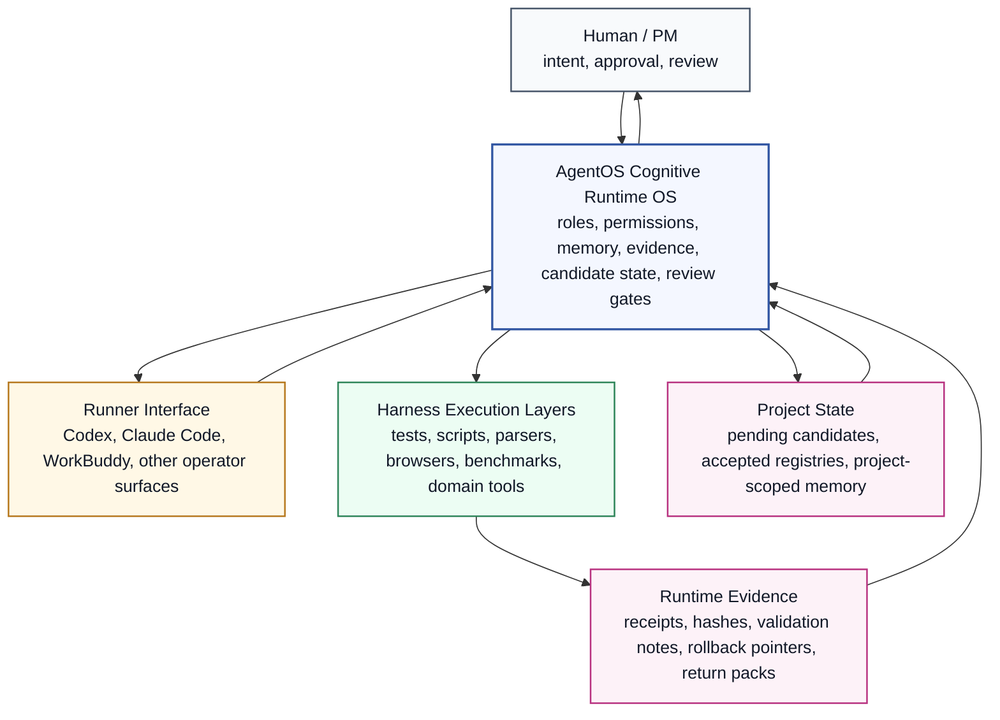
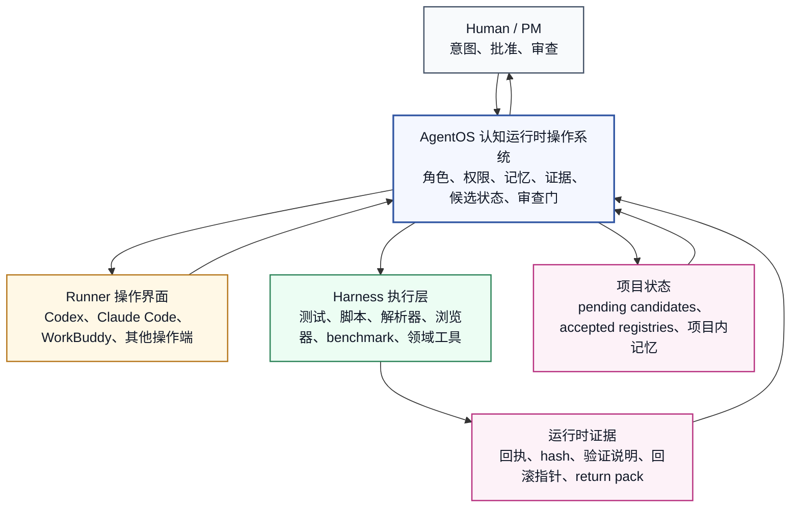

# AgentOS CoreSlim Base / AgentOS CoreSlim 基座

## English

AgentOS is a cognitive runtime operating system for AI-agent work. Its goal is to give runners and Harnesses a shared runtime layer: a place where roles, permissions, evidence, memory, execution receipts, review gates, and rollback rules are coordinated.

AgentOS is not a plugin for Codex, Claude Code, WorkBuddy, or any other runner. It is the operating layer those runners connect to. It is also not just a test Harness or automation script. Harnesses execute work for AgentOS; they do not define the system's authority.

CoreSlim is the clean base of that operating system. It is intentionally small: enough to start a governed AgentOS project, not so large that it brings unstable research-line evolution or private project context into the base.

### The Short Version

AgentOS exists so AI work can run as a governed runtime rather than a pile of disconnected sessions.

In this model:

- **Runners** are operator surfaces. Codex, Claude Code, WorkBuddy, and similar tools help a human interact with the project.
- **Harnesses** are execution surfaces. They run tests, scripts, browsers, parsers, benchmarks, package builders, domain tools, or other bounded operations.
- **AgentOS** is the cognitive runtime OS. It defines the roles, permissions, state transitions, candidate rules, evidence requirements, review gates, and return artifacts that make the work trustworthy.

The runner may type the command. The Harness may run the check. AgentOS decides what the work means in the project lifecycle.

### System Architecture



### Why This Matters

Modern agent tools are powerful, but they usually leave the project with a runtime gap.

A runner can edit files, but it may not know whether the edit is only a candidate. A Harness can run a test, but a passing test does not decide whether a registry should change. A model can summarize memory, but the project still needs to know where the evidence came from, whether it is reusable, and who approved promotion.

AgentOS fills that gap. It gives the project a runtime discipline for:

- what can be attempted;
- who or what may execute it;
- which evidence is required;
- where the result is stored;
- whether the result remains pending, is rejected, or is promoted;
- how another runner, window, or maintainer can continue the work;
- how the project rolls back when a candidate should not stand.

This is why the system is framed as an operating system rather than a helper library. It owns the cognitive runtime contract around the tools.

### The Role AgentOS Plays

AgentOS sits between human intention and tool execution.

It receives goals, seeds, pointers, or task prompts from a human/PM. It allows a runner to operate the project. It sends bounded work to one or more Harnesses. It records evidence and receipts. It keeps candidate state separate from accepted state. It gives humans a reviewable return pack instead of asking them to trust an unstructured agent transcript.

The important relationship is:

```text
Human / PM intention
  -> AgentOS cognitive runtime OS
     -> Runner interface: Codex, Claude Code, WorkBuddy, or another operator surface
     -> Harness execution layers: tests, scripts, parsers, browsers, benchmarks, domain tools
  -> Evidence, receipts, memory candidates, rollback pointers, return packs
  -> Human / PM review and promotion decision
```

Runners and Harnesses can be swapped. The runtime rules should remain legible.

### Problems AgentOS Is Meant To Solve

**Disconnected runner sessions.** AgentOS turns individual sessions into project cycles with seeds, decisions, evidence, and handoff artifacts.

**Unclear authority.** A runner can propose and operate; a Harness can execute and report; AgentOS preserves the rule that promotion requires the proper review gate.

**Evidence loss.** Execution receipts, manifests, hashes, validation notes, and rollback pointers become part of the normal output, not an afterthought.

**Memory drift.** Project learning can become a scoped candidate memory or policy prior, instead of a vague statement hidden in a chat log.

**Unsafe cross-project transfer.** A lesson from one project does not become a global rule unless the evidence, scope, and review path support that transfer.

**Research/base contamination.** Experimental self-evolution outputs can be kept as evidence without silently entering the clean CoreSlim base.

### How To Use It In Practice

The easiest way to start is not to build a giant platform. Start by treating AgentOS as the runtime contract for one real project.

1. Choose a runner for the human-facing workflow.
2. Give AgentOS a seed, pointer, issue, or task prompt.
3. Let the runner operate through AgentOS rules rather than free-form improvisation.
4. Attach only the Harnesses needed for the current task.
5. Run the checks and collect receipts.
6. Produce a return pack: what changed, what evidence was used, what passed, what remains pending, and how to roll back.
7. Keep candidates pending until the human/PM review gate promotes them.

The pleasant use pattern is:

```text
Use the runner for flow.
Use Harnesses for execution.
Use AgentOS as the cognitive runtime OS that keeps the work coherent.
```

### Recommended Runners

Runners are not the center of AgentOS. They are replaceable ways to operate the runtime.

- **Codex** is a strong default for repository maintenance, local code changes, tests, packaging, return packs, and GitHub handoff.
- **Claude Code** can be used as another local coding runner for navigation, patching, and review-oriented workflows.
- **WorkBuddy** is useful when the project needs workspace coordination, task tracking, handoff continuity, or daily operating support.
- Other runners can be connected if they can respect the same runtime contract: read the seed, operate locally, preserve candidate boundaries, run checks, and return evidence.

A runner should not be asked to become the source of truth. It is an operator interface into AgentOS.

### Harness Execution Layers

Harnesses are also not the center of AgentOS. They are bounded execution layers connected to the runtime.

Possible Harnesses include:

- local shell, Python, pytest, or build Harnesses;
- document parsing and extraction Harnesses;
- data validation Harnesses;
- browser, UI, or app automation Harnesses;
- simulation, benchmark, or evaluation Harnesses;
- packaging and release Harnesses;
- domain Harnesses for VC, education, manufacturing, research, legal, healthcare, or other project worlds.

A Harness output means: something was run and produced evidence. It does not mean: the project has accepted a new truth. AgentOS keeps that distinction explicit.

### What Is Inside CoreSlim

CoreSlim currently provides a compact set of base mechanisms:

- bounded local tool execution through `CodexToolBridge`;
- project-scoped ICM evolution policy for evidence-backed candidates;
- baseline evolution proposal protocol for human-reviewable updates;
- `DomainObjectModeler` for candidate-only domain object modeling;
- seed pack and return pack discipline;
- tests that check the main governance boundaries.

These pieces are small by design. CoreSlim is the base runtime, not the full future AgentOS product.

### What AgentOS CoreSlim Can Do

- Bootstrap a clean cognitive runtime base for downstream AgentOS projects.
- Let runners operate through explicit runtime boundaries.
- Attach different Harness execution layers without giving them governance authority.
- Keep new behavior candidate-only until reviewed.
- Preserve evidence, validation notes, hash inventories, and rollback pointers.
- Support project-scoped learning without mutating global truth.
- Package handoff materials so another runner, maintainer, or window can continue.
- Separate base maintenance from research self-evolution.

### What It Should Not Be Used For

- Treating a runner as the final authority.
- Treating a Harness result as automatic acceptance.
- Autonomous production deployment.
- Legal, financial, medical, or operational commitments without human authority.
- Silent mutation of accepted registries or official baselines.
- Importing private material into shared/global models without permission review.
- Claiming AGI or production readiness because local tests pass.

### Current Status

- Branch: `AgentOS`
- Status: base-maintenance candidate for PM/human review
- Intended use: bootstrap and maintain AgentOS CoreSlim based projects
- Validation:

```text
pytest -q agentos_core_slim_v0/tests
28 passed

python -m compileall -q agentos_core_slim_v0
passed
```

Before a formal public release, review license/distribution policy, CI workflow, package metadata, release tags, signed pointer approval, and public/private data boundaries.

### Repository Layout

```text
agentos_core_slim_v0/   CoreSlim kernel modules and tests
configs/                Local configuration templates
project_baselines/      Project baseline pointers and notes
scripts/                Historical and validation runner scripts
seedpacks/              PM seed packs and patch handoff materials
outputs/                Return packs, validation reports, hash inventories
_incoming/              Received seed packs and integration evidence
```

## 中文

AgentOS 是面向 AI-agent 工作的认知运行时操作系统。它的目标，是给 runner 和 Harness 提供一层共同的运行时：角色、权限、证据、记忆、执行回执、审查门和回滚规则，都在这一层被协调。

AgentOS 不是 Codex、Claude Code、WorkBuddy 或其他 runner 的插件。相反，runner 是接入 AgentOS 的操作界面。AgentOS 也不只是一个测试 Harness 或自动化脚本。Harness 为 AgentOS 执行动作，但不定义系统的权威。

CoreSlim 是这个操作系统的干净基座。它刻意保持小：足够启动一个有治理的 AgentOS 项目，但不会把不稳定的研究线演化、私人项目上下文或一次性自动化习惯带进基座。

### 一句话说明

AgentOS 的存在，是为了让 AI 工作运行在一个有治理的 runtime 中，而不是散落成一堆互不相连的会话。

在这个模型里：

- **Runner** 是操作界面。Codex、Claude Code、WorkBuddy 等工具帮助人类操作项目。
- **Harness** 是执行界面。它们运行测试、脚本、浏览器、解析器、benchmark、打包器、领域工具或其他有边界动作。
- **AgentOS** 是认知运行时操作系统。它定义角色、权限、状态转移、候选规则、证据要求、审查门和回传材料，让这些工作可以被信任。

runner 可以输入命令。Harness 可以运行检查。AgentOS 决定这些工作在项目生命周期中意味着什么。

### 系统架构图



### 为什么这件事重要

现在的 agent 工具已经很强，但它们通常留下一个 runtime 缺口。

runner 可以改文件，但它未必知道这个修改只是候选。Harness 可以跑测试，但测试通过并不等于 registry 应该改变。模型可以总结记忆，但项目仍然需要知道证据从哪里来、能不能复用、谁批准了提升。

AgentOS 填补的就是这个缺口。它给项目提供一套运行时纪律，用来说明：

- 什么可以尝试；
- 谁或什么可以执行；
- 需要哪些证据；
- 结果存放在哪里；
- 结果是 pending、rejected，还是 promoted；
- 另一个 runner、窗口或维护者怎样继续；
- 当候选不成立时，项目怎样回滚。

这就是为什么这里把 AgentOS 表达为操作系统，而不是辅助库。它拥有围绕工具运行的认知 runtime contract。

### AgentOS 扮演什么角色

AgentOS 位于人类意图和工具执行之间。

它接收 human/PM 给出的 goal、seed、pointer 或 task prompt。它允许 runner 操作项目。它把有边界的任务交给一个或多个 Harness。它记录证据和回执。它把 candidate state 和 accepted state 分开。它给人类一份可审查的 return pack，而不是要求人类信任一段松散的 agent transcript。

重要关系是：

```text
Human / PM intention
  -> AgentOS cognitive runtime OS
     -> Runner interface: Codex、Claude Code、WorkBuddy 或其他操作界面
     -> Harness execution layers: tests、scripts、parsers、browsers、benchmarks、domain tools
  -> Evidence、receipts、memory candidates、rollback pointers、return packs
  -> Human / PM review and promotion decision
```

runner 和 Harness 都可以替换。运行时规则应该保持清楚。

### AgentOS 要解决的问题

**runner 会话分散。** AgentOS 把单次会话整理成有 seed、decision、evidence 和 handoff artifact 的项目周期。

**权威关系不清。** runner 可以提议和操作；Harness 可以执行和报告；AgentOS 保留“提升必须经过正确审查门”的规则。

**证据丢失。** execution receipt、manifest、hash、validation note 和 rollback pointer 变成正常输出，而不是事后补材料。

**记忆漂移。** 项目学到的东西可以成为有作用域的候选记忆或 policy prior，而不是藏在聊天记录里的模糊说法。

**跨项目迁移不安全。** 一个项目里的经验不会自动变成全局规则，除非证据、作用域和审查路径都支持迁移。

**研究线污染基座。** experimental self-evolution 输出可以作为证据保存，但不会静默进入干净的 CoreSlim base。

### 实际上怎么使用

最容易的启动方式，不是先搭一个庞大平台，而是把 AgentOS 当作一个真实项目的 runtime contract。

1. 为人类工作流选择一个 runner。
2. 给 AgentOS 一个 seed、pointer、issue 或 task prompt。
3. 让 runner 按 AgentOS 规则操作，而不是自由发挥。
4. 只接入当前任务需要的 Harness。
5. 运行检查并收集回执。
6. 输出 return pack：改了什么、用了什么证据、什么通过了、什么仍然 pending、如何回滚。
7. 在 human/PM 审查门提升之前，候选结果保持 pending。

最舒服的使用模式是：

```text
用 runner 保持操作流畅。
用 Harness 执行动作。
用 AgentOS 作为认知运行时操作系统，让整件事保持一致。
```

### 推荐 Runner

runner 不是 AgentOS 的中心。runner 是操作 AgentOS runtime 的可替换界面。

- **Codex**：适合作为仓库维护、本地代码修改、测试、打包、return pack 和 GitHub 交接的默认 runner。
- **Claude Code**：适合作为另一种本地编码 runner，用于仓库导航、patch 实现和 review 风格工作流。
- **WorkBuddy**：适合需要 workspace 协调、任务跟踪、交接连续性和日常运营支持的项目。
- 其他 runner 也可以接入，只要它能遵守同一套 runtime contract：读取 seed，本地操作，保留候选边界，运行检查，返回证据。

runner 不应该成为真值来源。它是进入 AgentOS 的操作界面。

### Harness 执行层

Harness 也不是 AgentOS 的中心。Harness 是接入 runtime 的有边界执行层。

可以接入的 Harness 包括：

- 本地 shell、Python、pytest 或 build Harness；
- 文档解析与抽取 Harness；
- 数据验证 Harness；
- 浏览器、UI 或 app 自动化 Harness；
- 仿真、benchmark 或 evaluation Harness；
- 打包与发布 Harness；
- 面向 VC、教育、制造、研究、法律、医疗等领域的专用 Harness。

Harness 输出意味着：某件事被执行了，并产生了证据。它不意味着：项目已经接受了一个新的真值。AgentOS 会把这一区别保持清楚。

### CoreSlim 里面有什么

CoreSlim 当前提供一组小而干净的基座机制：

- 通过 `CodexToolBridge` 进行有边界的本地工具执行；
- 项目内 ICM 演化策略，用于有证据支撑的候选项；
- baseline evolution proposal protocol，用于生成可由人类审查的基线更新提案；
- `DomainObjectModeler`，用于 candidate-only 的领域对象建模；
- seed pack 和 return pack 纪律；
- 覆盖主要治理边界的测试。

这些能力刻意保持小。CoreSlim 是基础 runtime，不是完整的未来 AgentOS 产品套件。

### AgentOS CoreSlim 能做什么

- 为下游 AgentOS 项目启动一个干净的认知 runtime 基座。
- 让 runner 在明确运行时边界内操作。
- 接入不同 Harness 执行层，但不把治理权交给 Harness。
- 让新行为在审查前保持 candidate-only。
- 保存证据、验证说明、hash inventory 和 rollback pointer。
- 支持项目内学习，但不直接改写全局真值。
- 打包交接材料，让另一个 runner、维护者或窗口可以继续。
- 将 base maintenance 与 research self-evolution 分开。

### 不应该用它做什么

- 把 runner 当成最终权威。
- 把 Harness 结果当成自动接受。
- 自治生产部署。
- 在没有人类授权时做法律、金融、医疗或运营承诺。
- 静默修改 accepted registry 或官方 baseline。
- 未经权限审查，把私人材料写入 shared/global model。
- 因为本地测试通过就宣称 AGI 达成或生产就绪。

### 当前状态

- 分支：`AgentOS`
- 状态：base-maintenance 候选版本，等待 PM/human review
- 用途：启动和维护基于 AgentOS CoreSlim 的项目
- 验证：

```text
pytest -q agentos_core_slim_v0/tests
28 passed

python -m compileall -q agentos_core_slim_v0
passed
```

正式公开 release 前，建议复核 license 与分发策略、CI workflow、package 元数据、release tag、签署式 pointer approval，以及 public/private 数据边界。

### 仓库结构

```text
agentos_core_slim_v0/   CoreSlim 内核模块与测试
configs/                本地配置模板
project_baselines/      项目基线指针与说明
scripts/                历史 runner 与验证脚本
seedpacks/              PM seed pack 与 patch 交接材料
outputs/                return pack、验证报告、hash inventory
_incoming/              已接收的 seed pack 与集成证据
```
